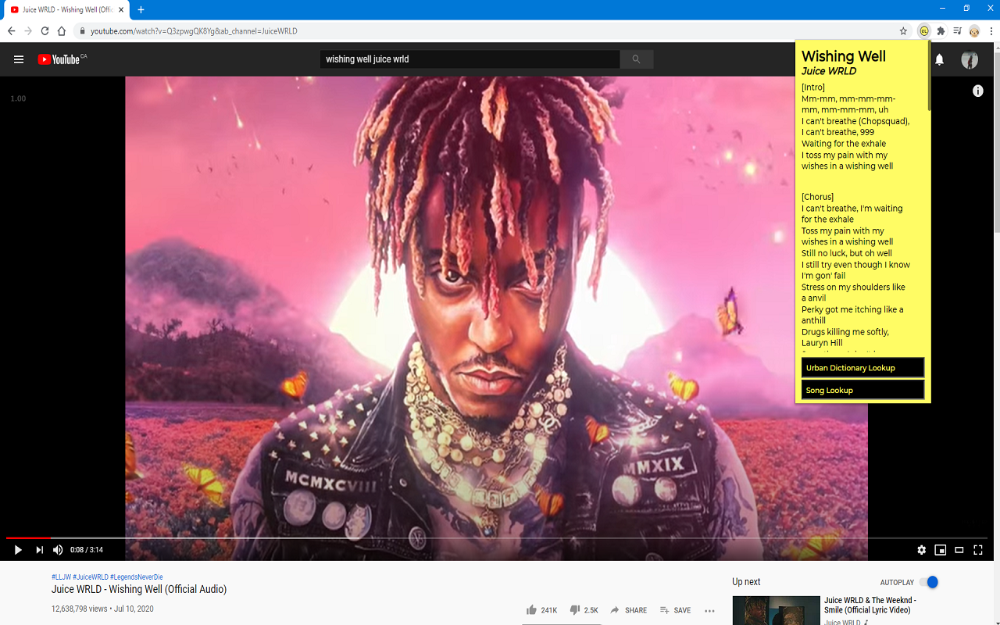

 # Urban Lyrics
 
 Description: An extension that provides its user with lyrics to a song with the click of a button. It also has integrated search boxes for word definitions by Urban Dictionary and also for custom song lookups. At the end of the song lyrics is also a Genius link for the current song displayed. 
 
 Technologies/libraries used:
 - Frontend: Typescript, React, Styled Components, Chrome API, Webpack
 - Backend: Node JS, Express, Puppeteer, Heroku
 
 
 
 Collaborated with [David Mcnamee](https://github.com/davidmcnamee) to build this project!
